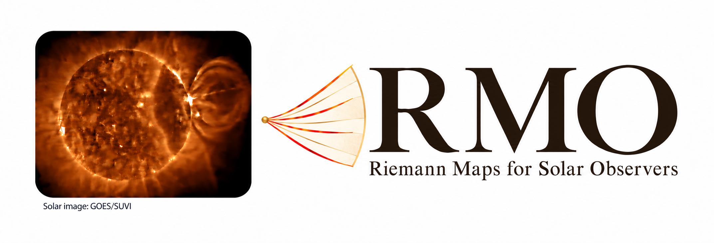

# RMO — Riemann Map Operator



**[Open RMO QuickLook](https://rmo-solar.org/) · [Download the complete archive](https://zenodo.org/records/22970620)**

**A bright front moves across the Sun. What is the plasma doing?**

RMO — Riemann Map Operator — tests which connections between neighbouring plasma states are compatible with supplied observations and assumptions within ideal magnetohydrodynamics (MHD). QuickLook helps users inspect model results, review literature inputs and identify measurements needed to distinguish candidate explanations.

## Solar-front local-fan example — 27 September 2026

The three example and diagnostic shortcuts are grouped in a compact row. The solar-front example explains “Initial states → calculated wave structure”: its explicitly chosen initial states have not been uniquely determined by observations. “Fast or slow?” opens the E05 geometry-discrimination evidence (R132); it does not label the SUVI front.

This version uses one illustrative 750 km/s model throughout the teaching example, with matching LEFT/RIGHT inputs, eight connected states, wave speeds, energy-flux checks and vector diagrams. A front-normal sketch explains that the Riemann connection runs across a front, not along the solar arc. Public SUVI imagery supplies context, not recovered plasma states.

For the explicitly assumed states, the regular solution contains a fast rarefaction, two Alfvén rotations, two slow shocks, a contact and an outer fast shock. The adopted speed is not an observed determination. Independent scalar conservation checks and a finite-volume comparison verify the model problem, not seven observed wave detections or uniqueness. Other input states may change the wave pattern.

## Front-interaction example

The “Explore a front interaction” example follows two prescribed incoming shocks through their collision and displays a connected outgoing regular MHD wave pattern. Users can inspect density, pressure, normal velocity and transverse magnetic field, move through the model time sequence, and export the exact LEFT/RIGHT states and results for an independent solver.

The calculated outgoing pattern includes fast and slow rarefactions, a contact and two shocks. The Alfvén rotations have zero amplitude in this example. The source includes checks of conservation jump conditions, entropy and characteristic relations, together with a finite-volume comparison. The branch search is incomplete; the example does not establish uniqueness or exhaustive coverage of MHD solutions.

This is a dimensionless model benchmark with prescribed states. It is not a reconstruction or classification of an observed solar event. No solar calibration or observed Alfvén-wave detection is claimed.

## Updated logo

This archive includes the updated RMO logo with the Sun and a folding fan. The logo is artwork, not an observational image. Artwork attribution is recorded in THIRD_PARTY_NOTICES.md.

## Archived source and reproduction

Archive identifier: **1.0.0+local-fan.20260927**. The application version remains 1.0.0.

GitHub commit: 71d702dfc0c85cf63208feb17bb83950a22a85e5.

Repository: [https://github.com/epodlad/RMO](https://github.com/epodlad/RMO)

The complete ZIP archive contains 504 files matching that GitHub tree. Download and extract **RMO-1.0.0-public-20260927.zip**, enter the RMO-1.0.0 directory, and run:

`python verify_manifest.py`

SHA256SUMS.txt provides checksums for the ZIP and the separately supplied RMO_logo.png. No base archive, multipart assembly or overlay is needed.

To recompute the regular fan, run:

`python -B examples/solar20170910_full_fan/run.py`

For scalar conservation checks, run:

`python -B examples/solar20170910_full_fan/check_conservation.py`

The interaction benchmark is documented in docs/FRONT_INTERACTION.md.

## Two ways to use RMO

**Online:** open [https://rmo-solar.org/](https://rmo-solar.org/) and select “Solar front · full MHD fan” or “Explore a front interaction”. The website also provides saved model examples, literature-event reviews and a hosted calculation service for supported inputs. Download inputs and results to retain your work.

**Locally:** extract the ZIP archive and open a terminal in the directory containing requirements.txt. The verified runtime is Python 3.12.14. Install dependencies in a virtual environment:

`python -m pip install -r requirements.txt`

Then start the application:

`python -B -m local_app.server --port 8765`

Open [http://127.0.0.1:8765](http://127.0.0.1:8765) in a browser. README.md gives platform-specific instructions. Opening the HTML file alone does not start the calculation service.

## Scientific scope and citation

Brightness and image-pattern speed alone do not determine the MHD wave type or the plasma velocity. Results depend on the supplied states, uncertainties, assumptions, implemented models and search limits. A literature-input review is not an observational mode identification.

For this version, cite **DOI 10.5281/zenodo.22970620**.

Previous releases:

- Full-fan snapshot: [https://doi.org/10.5281/zenodo.22966003](https://doi.org/10.5281/zenodo.22966003)
- Front-interaction snapshot: [https://doi.org/10.5281/zenodo.22963649](https://doi.org/10.5281/zenodo.22963649)
- Earlier RMO 1.0.0 record: [https://doi.org/10.5281/zenodo.22905556](https://doi.org/10.5281/zenodo.22905556)

The separate **Scientific Archive R139**, [https://doi.org/10.5281/zenodo.22742107](https://doi.org/10.5281/zenodo.22742107), retains its original scientific evidence and is unchanged by this interface/example update. Cite that companion and the relevant original sources when using its data, figures or analyses.

## License and acknowledgements

Original RMO code is licensed under **Apache-2.0**. Third-party materials retain their own terms and acknowledgements; see THIRD_PARTY_NOTICES.md.

SUVI imagery and video retain NOAA SWPC attribution, with Seaton and Darnel (2018) as the scientific reference.

## Local setup for Windows, Linux and macOS

The verified runtime is **Python 3.12.14**, with dependencies pinned in `requirements.txt`. Install them in a virtual environment, then start the local Python server.

**Linux / macOS:**

```sh
python3.12 -m venv .venv
. .venv/bin/activate
python -m pip install -r requirements.txt
python -B -m local_app.server --port 8765
```

**Windows — Command Prompt:**

```bat
py -3.12 -m venv .venv
.venv\Scripts\activate.bat
python -m pip install -r requirements.txt
python -B -m local_app.server --port 8765
```

Open **[http://127.0.0.1:8765](http://127.0.0.1:8765)** in a browser. The interface and calculations now run on your computer. Keep the terminal and Python process open while using the application. Opening `public/index.html` directly does not start the calculation service or resolve all assets.

Local completed requests and results are written under `results/local_runs/`, in a new directory for each server session. Set `RMO_RESULTS_DIR` to choose a different output parent. Existing session directories are not overwritten. The interface also offers portable JSON and, where available, PDF downloads.

## Further documentation

- [Solar-front example and portable states](examples/solar20170910_full_fan/README.md)
- [Front-interaction example and physical checks](docs/FRONT_INTERACTION.md)
- [Software archives and source snapshots](docs/RELEASE_ZENODO.md)
- [Scientific reproduction](docs/REPRODUCIBILITY.md)
- [Release acceptance and its scope](docs/RELEASE_ACCEPTANCE.md)
- [Hosting your own Render service](docs/DEPLOY_RENDER.md)
- [Third-party licences and acknowledgements](THIRD_PARTY_NOTICES.md)
